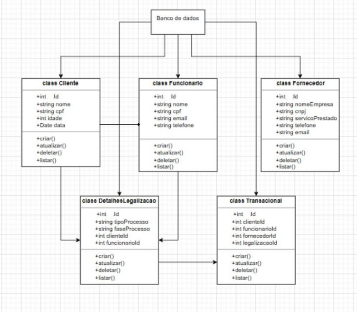

# PROJETO FINAL - M2 | ANÁLISE E IMPLEMENTAÇÃO DE SOFTWARE

CONSULTORIA DE GOVERNANÇA DE TI PARA O ESCRITÓRIO CRUZEIRO DO SUL - SERVIÇOS CONTÁBEIS

Grupo:
Edmilson Correa RGM:
Karoline Souza RGM:
Ramon Alves RGM: 11241504520
Samuel Alves RGM:

## Sumário 📖
* [1. | Sobre o projeto](#1--sobre-o-projeto)
    * [1.1 | Prévia](#11--prévia)
    * [1.2 | Tecnologias Utilizadas](#12--tecnologias-utilizadas)
    * [1.3 | Arquitetura do Projeto](#13--arquitetura-do-projeto)
    * [1.4 | Modelagem](#14--modelagem)
    * [1.5 | Classes Java](#15--classes-java)
    * [1.6 | Arquivos JSP](#16--arquivos-jsp)
    * [1.7 | Banco de Dados](#17--banco-de-dados)
    * [1.8 | Como Executar](#18--como-executar)
* [2. | Informações](#2--informações)

<hr>

### 1. | Sobre o projeto 🗒️

Esse projeto foi construído como nota M2 da disciplina de Análise e Implementação de Software, do curso Análise e Desenvolvimento de Sistemas na UMC - Universidade Mogi das Cruzes.

Esse projeto visa a criação de um sistema de contabilidade para a empresa Cruzeiro do Sul - Serviços Contábeis, para ter uma centralização mais robusta de informações e resolver algumas dificuldades apresentadas por um dos seus funcionários, que também é um dos nossos integrantes do grupo.

### 1.1 | Prévia 💻

<video src="preview/Previa.mp4" controls></video>

#### 🔗 Figma
[Link Figma](https://www.figma.com/design/hWxcTM917NKh2w9ZpM0jZH/Untitled?node-id=0-1&p=f)

### 1.2 | Tecnologias utilizadas 

| Categoria          | Tecnologia        |
| :----------------- | :---------------- |
| **Frontend**       | `HTML5, CSS3, JS` |
| **Backend**        | `Java, JSP`       |
| **Banco de Dados** | `MySQL`           |

### 1.3 | Arquitetura do projeto 🏗️

O projeto utiliza o modelo de arquitetura em Camadas (Layered Architecture) básica,

O projeto segue a Arquitetura em Camadas (Layered Architecture) básica, priorizando a Separação de responsabilidades entre o código de entidade e a lógica. Implementamos o Padrão DAO (Data Access Object) para gerenciar o acesso ao banco de dados.

Segue abaixo a estrutura das pastas.


Explicarei agora um pouco do projeto.

### 1.4 | Modelagem 🧩



### 1.5 | Classes Java 📝

#### └── Config <br> &nbsp;&nbsp;&nbsp;&nbsp;└─ ConectaBanco

Essa classe faz a conexão com o BD usando o método conectar(), esse método retorna um booleano onde:

- Se a conexão for bem sucedida retorna true
- Se a conexão der falha retorna false

```java

public static Connection conectar() throws ClassNotFoundException {
    Connection conn = null;

    try {
        Class.forName("com.mysql.jdbc.Driver");
        conn = DriverManager.getConnection("jdbc:mysql://localhost:3306/meilegal", "root", "SuricatoManco1.");
    } catch (SQLException err) {
        System.out.println("Erro - SQL: " + String.valueOf(err));
    }

    return conn;
}

```

#### └── Model <br> &nbsp;&nbsp;&nbsp;&nbsp;└─ Cliente.java <br> &nbsp;&nbsp;&nbsp;&nbsp;└─ Fornecedor.java <br> &nbsp;&nbsp;&nbsp;&nbsp;└─ Funcionario.java <br> &nbsp;&nbsp;&nbsp;&nbsp;└─ Geral.java <br> &nbsp;&nbsp;&nbsp;&nbsp;└─ Legalizacao.java

Aqui modelei as classes dos objetos passando os parâmetros junto com os métodos Setters e Getters.

```java
// Exemplo: Cliente.java
public class Cliente {
   private int Id;
   private String Nome;
    // ...

   // Getters
   public int getId() {
      return this.Id;
   }

   public String getNome() {
      return this.Nome;
   }

    // ...

   // Setters
   public void setId(int Id) {
      this.Id = Id;
   }

   public void setNome(String Nome) {
      this.Nome = Nome;
   }

    // ...
}


```

#### └── ModelDAO
#### &nbsp;&nbsp;&nbsp;&nbsp;└─ ClienteDAO.java <br> &nbsp;&nbsp;&nbsp;&nbsp;└─ FuncionarioDAO.java <br> &nbsp;&nbsp;&nbsp;&nbsp;└─ FornecedorDAO.java <br>&nbsp;&nbsp;&nbsp; └─ LegalizacaoDAO.java <br> &nbsp;&nbsp;&nbsp;&nbsp;└─ GeralDAO.java

Praticamente todas as classes DAO tem os mesmos métodos, sendo eles:
- cadastrar;
- consulta_geral;
- consulta_id;
- alterar;
- excluir;

Com exceção da classe Geral que só tem a consulta_geral e o LegalizacaoDAO que foi adicionada mais algumas classes, vou explicar mais para frente.

A seguir, os métodos:

```java
// cadastrar(Objeto objeto)
   public boolean cadastrar(Objeto objeto) throws ClassNotFoundException {

      // Método herdado do Config.conectaBanco
      Connection conn = null; 

      try {
         conn = ConectaBanco.conectar();
         String sql = "INSERT INTO Tabela (x, x, x, x, x) VALUES (?, ?, ?, ?, ?)";
         PreparedStatement stmt = conn.prepareStatement(sql, 1);
        
        stmt.setString(1, objeto.getX());

         // ...

         // Roda a query no BD
         stmt.executeUpdate();

         // Busca o ID do Objeto (que no BD está criado como AUTO_NUMBER) e seta ele
         try (ResultSet rs = stmt.getGeneratedKeys()) {
            if (rs.next()) {
               objeto.setId(rs.getInt(1));
            }
         }

         conn.close();
         return true;

         // Se houve erro na inserção, esse catch vai mandar o erro.
      } catch (SQLException err) {
         System.out.println("Erro SQL: " + err);
         return false;
      }
   }

```

Esse método é utilizado para inserir registros no BD.

```java
// consultar_geral()

   public List<Objeto> consultar_geral() throws ClassNotFoundException {
      List<Objeto> lista = new ArrayList();
      Connection conn = null;

      try {
         conn = ConectaBanco.conectar();
         Statement stmt = conn.createStatement();
         String sql = "SELECT * FROM Objeto";
         ResultSet rs = stmt.executeQuery(sql);

         // atribuindo valor nas variáveis do objeto
         while(rs.next()) {
            Objeto objeto = new Objeto();
            objeto.setId(rs.getInt("Id"));

            // ...

            lista.add(objeto);
         }

         conn.close();
         return lista.isEmpty() ? null : lista;

         // Se houve erro na query ele cai nesse catch
      } catch (SQLException err) {
         System.out.println("Erro SQL: " + err);
         return null;
      }
   }

```

Esse método é utilizado para resgatar os registros do BD e retornar eles em forma de uma lista de objetos.

```java
// consulta_id()

   public Objeto consulta_id(int id) throws ClassNotFoundException {
      Connection conn = null;
      Fornecedor fornecedor = null;

      String sql = "SELECT * FROM Objeto WHERE Id = ?";

      try {
         conn = ConectaBanco.conectar();

         try (PreparedStatement stmt = conn.prepareStatement(sql)) {
            
            stmt.setInt(1, id);

            try (ResultSet rs = stmt.executeQuery()) {
               if (rs.next()) {
                  Objeto = new Objeto();
                  objeto.setId(rs.getInt("Id"));
                  
                  // ...

               }
            } 
         }
      } catch (SQLException err) {
         System.out.println("Erro SQL: " + String.valueOf(err));
      } finally {
         if (conn != null) {
            try {
               conn.close();
            } catch (SQLException err) {
               System.out.println("Erro de Conexão: " + err);
            }
         }

      }

      return objeto;
   }

```

Esse método é utilizado para referenciar qual objeto eu vou querer alterar, quando chegar na vez do JSP eu explico com mais detalhes mas esse método tem a função de resgatar o ID do registro e retornar ele para mim.

```java
// alterar()

   public boolean alterar(Objeto objeto) throws ClassNotFoundException {
      Connection conn = null;

      try {
         conn = ConectaBanco.conectar();
         String sql = "UPDATE Objeto SET x=?, x=?, x=?, x=?, x=? WHERE Id=?";

         try (PreparedStatement stmt = conn.prepareStatement(sql)) {
            stmt.setString(1, fornecedor.getX());
 
            // ...

            stmt.setInt(6, fornecedor.getId());


            int linhasAfetadas = stmt.executeUpdate();

            return linhasAfetadas > 0;
   
         }

      } catch (SQLException err) {
         System.out.println("Erro SQL: " + err);
         return false;
      } finally {
         if (conn != null) {
            try {
               conn.close();
            } catch (SQLException err) {
               System.out.println("Erro ao fechar conexão: " + err);
            }
         }
      }
   }

```

Esse método é responsável por rodar o UPDATE no BD, ele é utilizado em conjunto com a consulta_id, pois o ID que referencia qual registro vai rodar o UPDATE vem da consulta_id.

```java
// deletar()

   public boolean deletar(Objeto objeto) throws ClassNotFoundException {
      Connection conn = null;

      try {
         conn = ConectaBanco.conectar();
         String sql = "DELETE FROM X WHERE Id=?";
         PreparedStatement stmt = conn.prepareStatement(sql);

         try {
            stmt.setInt(1, X.getId());

            stmt.executeUpdate();
         } 

      } catch (SQLException err) {
         System.out.println("Erro SQL: " + err);
         return false;
      } finally {
         if (conn != null) {
            try {
               conn.close();
            } catch (SQLException err) {
               System.out.println("Erro de Conexão: " + err);
            }
         }

      }
   }

```

Por fim dos métodos (padrões) temos o deletar, é responsável por rodar o DELETE no BD.

Agora, vamos as exceções. 

### Exceção <br> &nbsp;&nbsp;&nbsp; └─ LegalizacaoDAO.java 

Como citado acima a legalização é o CRUD que foge do padrão, isso porque ele é responsável por criar os relacionamentos entre as outras tabelas, logo ele é considerado um Junction Object. 

Como ele vai fazer essas referências ele possui métodos adicionais para realizar uma query nas outras tabelas, resgatando os registros necessários para atribuir valor aos dados resgatados, e mais a frente referênciar eles dentro de um select no formulário.

```java

   public List<ObjetoReferenciado> consultar_objetoReferenciado() throws ClassNotFoundException {
      List<ObjetoReferenciado> lista = new ArrayList();
      Connection conn = null;

      try {
         conn = ConectaBanco.conectar();
         Statement stmt = conn.createStatement();
         String sql = "SELECT Id, Nome FROM ObjetoReferenciado";
         ResultSet rs = stmt.executeQuery(sql);

         while(rs.next()) {
            ObjetoReferenciado objetoReferenciado = new ObjetoReferenciado();
            objetoReferenciado.setId(rs.getInt("Id"));
            objetoReferenciado.setDado(rs.getString("Dado"));
            lista.add(objetoReferenciado);
         }

         conn.close();

         if (lista.isEmpty()) {
            return null;
         } else {
            return lista;
         }
      } catch (SQLException err) {
         System.out.println("Erro SQL: " + err);
         return null;
      }
   }
```

Ao observar o método vemos que ele resgata o ID, que no caso seria a Foreign Key do objeto, e o dado que eu quero mostrar.

### 1.6 | Arquivos JSP 📝

Para os JSP eu organizei eles por pastas, separando por área de atuação (CadastroClientes, CadastroFornecedor, ...) e em cada pasta o arquivo JSP necessário para realizar as operações.

#### ─ jsp <br> └─ CadastroCliente <br> &nbsp; &nbsp; &nbsp; └─ AlterarDadosCliente.jsp <br> &nbsp; &nbsp; &nbsp; └─ Clientes.jsp <br> &nbsp; &nbsp; &nbsp; └─ alt_cliente.jsp <br> &nbsp; &nbsp; &nbsp; └─ cad_cliente.jsp <br> &nbsp; &nbsp; &nbsp; └─ del_cliente.jsp

Esses arquivos servem para: 
- Clientes.jsp: Esse é o arquivo principal, responsável por mostrar a tabela do crud.
- AlterarDadosCliente.jsp: Esse é o arquivo responsável pelo formulário de alteração.
- cad_cliente.jsp: Esse é o arquivo responsável pelo processamento dos dados que vem do formulário e pela inserção de dados no BD.
- alt_cliente.jsp: Esse é o arquivo responsável pelo processamento dos dados que vem do formulário e pela alteração no BD.
- del_cliente.jsp: Esse é o arquivo responsável pelo processamento dos dados que vem do formulário e realiza o delete no BD.

Vale a pena mencionar que tanto o Clientes quanto o AlterarDadosCliente também puxam um script JS para fazer a validação dos dados do formulário.

<br>

Do código do JSP eu gostaria de só deixar explicado a questão da Exceção da Legalização.

<hr>

#### Agora a explicação sobre os métodos da classe LegalizacaoDAO.

Lembra dos métodos adicionais da classe LegalizacaoDAO que realizavam uma query e me retornavam um ID e um Dado que eu queria ? Pois bem, eu tinha dito que essa query era necessária para inserir os dados no formulário do cadastro da legalização, aqui está a lógica dele:

```JSP
// Importando classes

<%@page import="java.util.*"%>
<%@page import="Model.Legalizacao" %>
<%@page import="Model.Cliente" %>
<%@page import="Model.Funcionario" %>
<%@page import="Model.Fornecedor" %>
<%@page import="ModelDAO.LegalizacaoDAO"%>

// ...

<form class="cad__form" method="POST" action="cad_legalizacao.jsp" id="form">
    <div class="input__container">
        <label for="idCliente">Selecione o Cliente</label>
        <select name="idCliente" id="idCliente">
            <option value="" disabled selected hidden>Selecione o Cliente</option>
            <%
                List<Cliente> listaCliente = null;
                try {
                    LegalizacaoDAO dao = new LegalizacaoDAO();
                    listaCliente = dao.consultar_clientes();
                } catch (Exception e) {
                    e.printStackTrace();
                    out.println("Erro na consulta: " + e.getMessage());
                }

                if (listaCliente == null || listaCliente.isEmpty()) {
                    out.println("<p style='text-align: center; grid-column: 1 / -1;'>Nenhum cliente encontrado!</p>");
                } else {
                    for (Cliente cliente : listaCliente) {
                        out.println("<option value=\"" + cliente.getId() + "\">" + cliente.getNome() + "</option>");
                    }
                }
            %>
        </select>
        <p class="data_error"></p>
    </div>

   // ...

```

Ao criar um \<select> eu posso definir uma lista de opções com o \<option>, essa lista de opções vem de um for que itera o resultado da query que vem do método de consulta da LegalizacaoDAO. 

Agora algo importante, como na modelagem dos dados o nosso BD está configurado para trabalhar com os FK_ID certo ? mas mostrar a tabela só com os números do ID não me falam nada, por isso eu atribui dessa forma: 

\<option value="cliente.getId()">cliente.getNome()\</option> 

Obs.: Eu ignorei a questão da interpolação de strings no jsp aqui no md só por questão de estética mesmo.

Embora eu esteja mostrando no option o nome do cliente neste exemplo, o dado que eu estou enviando para o BD e fazendo todas as transações de informações é o ID do cliente, a minha FK.

### 1.7 | Banco de Dados 📝

``` sql
/* ------------------------------ */
# | Criação do DataBase          | #
/* ------------------------------ */

CREATE DATABASE MeiLegal;
USE MeiLegal;

/* ------------------------------ */
# | Criação da tabela Clientes   | #
/* ------------------------------ */

CREATE TABLE Clientes (
	Id INT AUTO_INCREMENT PRIMARY KEY NOT NULL,
    Nome VARCHAR(100) NOT NULL,
    CPF VARCHAR(14) NOT NULL,
    Idade INTEGER(2) NOT NULL,
    DataCadastro DATE NOT NULL
);


/* ---------------------------------- */
# | Criação da tabela Funcionários   | #
/* ---------------------------------- */

CREATE TABLE Funcionarios (
	Id INT AUTO_INCREMENT PRIMARY KEY NOT NULL,
    Nome VARCHAR(100) NOT NULL,
    CPF VARCHAR(14) NOT NULL,
    Email VARCHAR(255) NOT NULL,
    Telefone VARCHAR(13) NOT NULL
);


/* ---------------------------------- */
# | Criação da tabela Funcionários   | #
/* ---------------------------------- */

CREATE TABLE Fornecedores (
	Id INT AUTO_INCREMENT PRIMARY KEY NOT NULL,
    RazaoSocial VARCHAR(100) NOT NULL,
    CNPJ VARCHAR(18) NOT NULL,
    Servico VARCHAR(255) NOT NULL,
    Telefone VARCHAR(13) NOT NULL,
    Email VARCHAR(255) NOT NULL
);


/* ---------------------------------- */
# | Criação da tabela Legalização    | #
/* ---------------------------------- */

CREATE TABLE Legalizacao (
	Id INT AUTO_INCREMENT PRIMARY KEY NOT NULL,
    TipoProcesso ENUM('Abertura', 'Alteração', 'Baixa', 'Regularização') NOT NULL,
    FaseProcesso ENUM('Análise', 'Protocolo', 'Deferido', 'Concluído') NOT NULL,
    
	# IDs das Foreign Keys
    /*-------------------------------------------------> Cliente */
    IdCliente INT NOT NULL,
    CONSTRAINT fk_legalizacaoCliente
		FOREIGN KEY (IdCliente)
        REFERENCES Clientes (Id)
        ON DELETE RESTRICT
        ON UPDATE CASCADE,
    
    /*-------------------------------------------------> Funcionário */
    IdFuncionario INT NOT NULL, 
    CONSTRAINT fk_legalizacaoFuncionario
		FOREIGN KEY (IdFuncionario)
        REFERENCES Funcionarios (Id)
        ON DELETE RESTRICT
        ON UPDATE CASCADE,
        
    /*-------------------------------------------------> Fornecedor */ 
    IdFornecedor INT NOT NULL,
    CONSTRAINT fk_legalizacaoFornecedor 
		FOREIGN KEY (IdFornecedor)
        REFERENCES Fornecedores (ID)
        ON DELETE RESTRICT
        ON UPDATE CASCADE
);


/* ---------------------------------- */
# | Criação da tabela Geral          | #
/* ---------------------------------- */    
    
CREATE TABLE Geral (
	Id INT AUTO_INCREMENT PRIMARY KEY NOT NULL,
    Status Boolean NOT NULL,
    
    # IDs das Foreign Keys
    /*-------------------------------------------------> Cliente */
    # Cliente
    IdCliente INT NOT NULL,
    CONSTRAINT fk_geralCliente
		FOREIGN KEY (IdCliente)
        REFERENCES Clientes (ID)
        ON DELETE RESTRICT
        ON UPDATE CASCADE,
    
    /*-------------------------------------------------> Funcionário */
    IdFuncionario INT NOT NULL,
    CONSTRAINT fk_geralFuncionario
		FOREIGN KEY (IdFuncionario)
        REFERENCES Funcionarios (ID)
        ON DELETE RESTRICT
        ON UPDATE CASCADE,
     
    /*-------------------------------------------------> Fornecedor */
    IdFornecedor INT NOT NULL,
    CONSTRAINT fk_geralFornecedor 
		FOREIGN KEY (IdFornecedor)
        REFERENCES Fornecedores (ID)
        ON DELETE RESTRICT
        ON UPDATE CASCADE,
    
    /*-------------------------------------------------> Legalização */
    IdLegalizacao INT NOT NULL,
    CONSTRAINT fk_geralLegalizacao 
		FOREIGN KEY (IdLegalizacao)
        REFERENCES Legalizacao (ID)
        ON DELETE RESTRICT
        ON UPDATE CASCADE
);

```

## 1.8 | Como executar ❔

Ao clonar o repositório ou baixar os arquivos brutos, utilizar o NetBeans para abrir o projeto. Não sei se a senha que eu utilizei aqui é a mesma para acessar o projeto mas segue ela mesmo assim: 

- Usuário: admin
- Senha: admin

Em seguida no seu MySQL Workbench rodar o script mySQL que está na pasta BD para criar o Banco de Dados.

Ao criar o BD é necessário acessar a classe ConectaBanco.java, armazenada no package Config. ao acessar essa classe é preciso realizar a alteração da Senha do seu BD.

```java
public static Connection conectar() throws ClassNotFoundException {
   Connection conn = null;

   try {
      Class.forName("com.mysql.jdbc.Driver");
        conn = DriverManager.getConnection("jdbc:mysql://localhost:3306/meilegal", "root", "SuaSenha");
   }

   // ...

}
```

Obs.: No meu código está uma senha aleatória (não julgue =P).

## 2 | Informações ℹ️

Esse projeto foi realizado pelos alunos:

| Nome            | RGM         |
| :-------------- | :---------- |
| Edmilson Correa | 11241101867 |
| Karoline Souza  | 11241103359 |
| Ramon Alves     | 11241504520 |
| Samuel Alves    | 11242402408 |